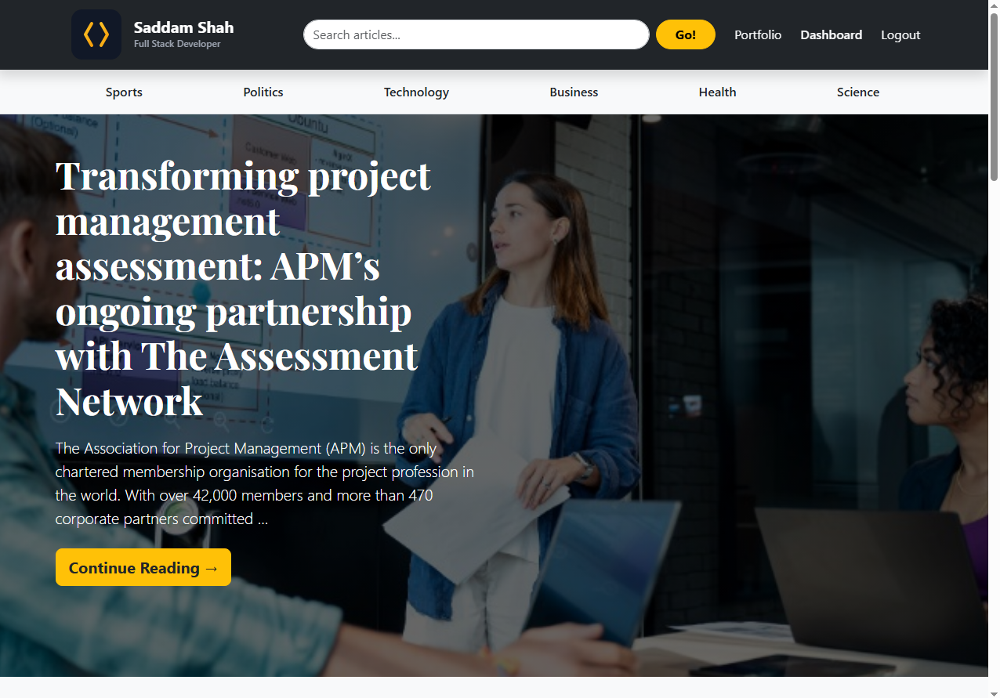
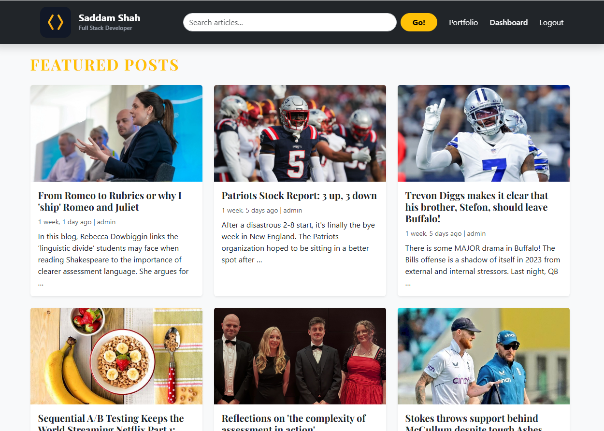
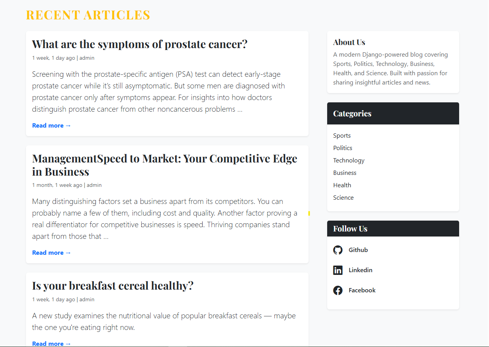
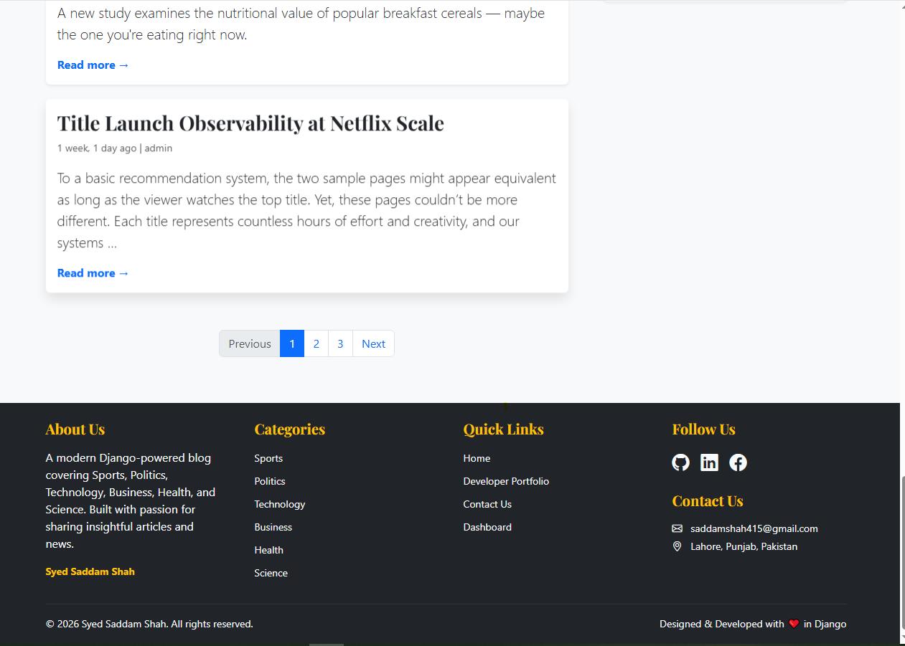
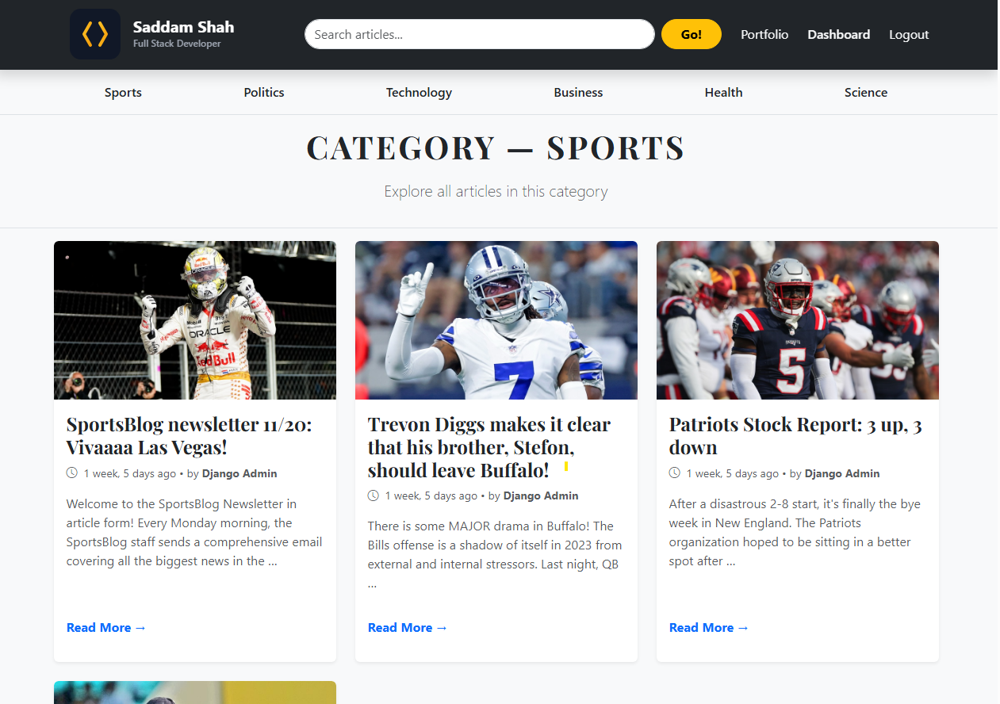
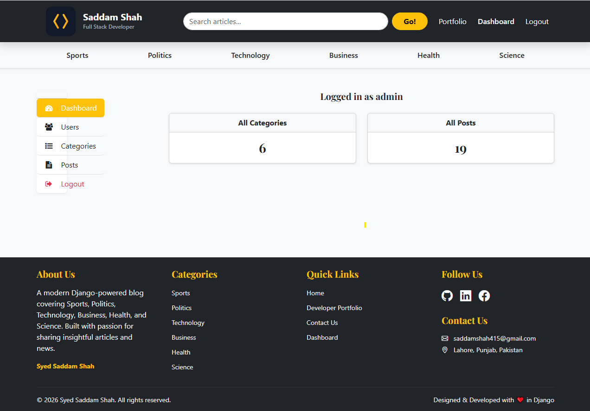
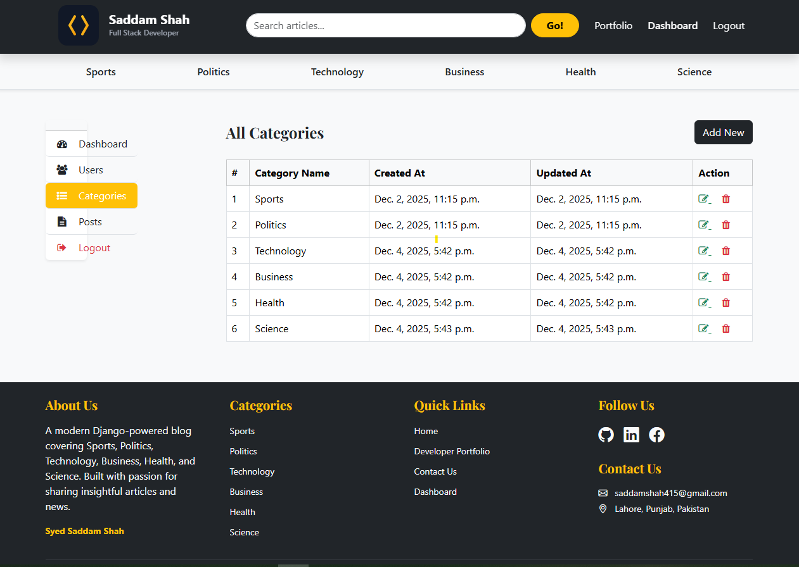
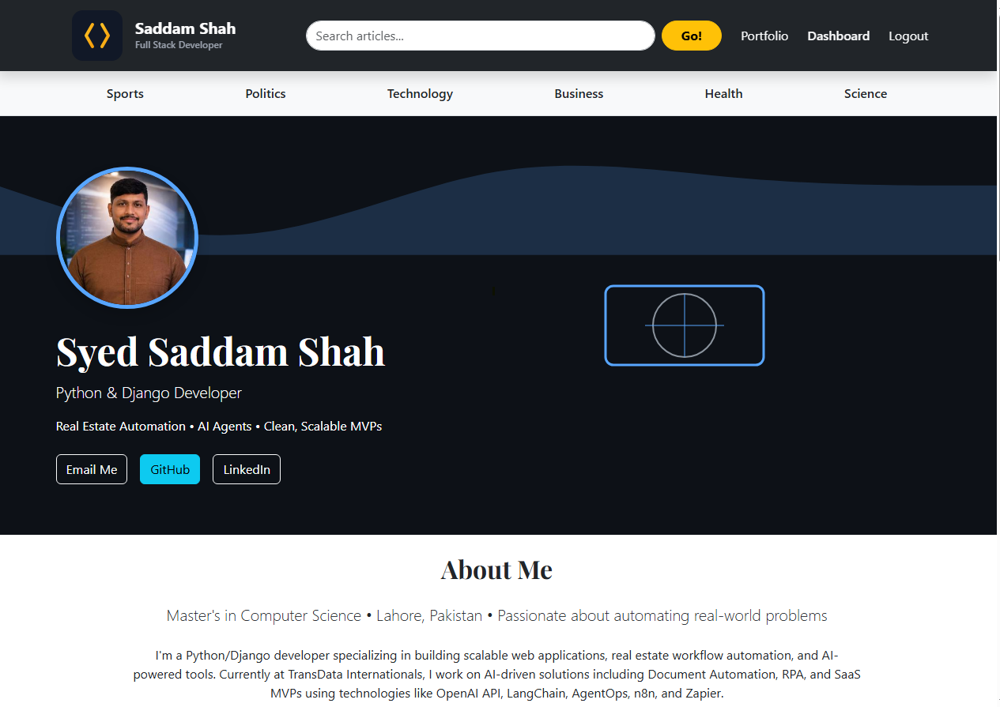

# Django Blog & Portfolio Platform

A full-featured, role-based blogging platform built with **Django** (backend) and **Bootstrap** (frontend). Started as a personal practice project and evolved into a complete functional application with separate dashboards for different user roles, a personal portfolio section, and dynamic content management.

Live Demo: 

## Features

- **Role-Based Access Control (RBAC)**:
  - **Admin**: Full access (create/manage users, assign roles, all content)
  - **Manager**: Manages editors and approves/oversees blogs
  - **Editor**: Creates, edits, and manages blog posts only
  - **Authenticated Users**: Can read blogs, log in to comment, and access a personal dashboard
  - **Anonymous Users**: Can only read blogs (no commenting)

- **Blog System**:
  - Multi-category blogs (Sports, Politics, Technology, Business, Health, Science, etc.)
  - Rich text editing, images, dynamic categories
  - Comments (authenticated users only)
  - Search functionality

- **Portfolio Section**:
  - Dedicated page showcasing personal projects, skills, and details

- **Dynamic About & Social Links**:
  - Editable about section and social media icons

- **Separate Dashboards**:
  - Custom frontend dashboards for Editor and Manager roles (no need for admin panel access)

- **Responsive Design**:
  - Fully mobile-friendly with Bootstrap 5

- **Other**:
  - User registration, login, logout
  - Admin panel enhancements
  - Clean separation of apps for maintainability

## Project Structure

blog_main/                 # Main Django project folder
├── assignments/           # Dynamic About section & social links
├── blog/                  # Handles all blog functionalities
├── dashboard/             # Role-based dashboards (admin, manager, editor)
├── portfolio/             # Personal portfolio details
├── templates/             # Frontend templates (Bootstrap)
├── static/                # CSS, JS, images
├── manage.py
└── requirements.txt       # Python dependencies

## Roles and Permissions

| Role     | Access                                                                 |
|----------|------------------------------------------------------------------------|
| Admin    | Full control of all apps and dashboards                                 |
| Manager  | Manage editors, approve blogs, view dashboards                         |
| Editor   | Create, edit, delete blogs                                             |
| User     | Read blogs, comment after login, view portfolio                        |

---

## Installation

1. Clone the repository:
bash
git clone https://github.com/SaddamShah92/django-blog.git
cd django-blog

2. Create a virtual environment:

python -m venv env
env\Scripts\activate      # Windows

3. Install dependencies:

pip install -r requirements.txt

4. Apply migrations:

python manage.py migrate

5. Create a superuser:

python manage.py createsuperuser

6. Run the development server:

python manage.py runserver

Open your browser at http://127.0.0.1:8000/

# Usage

Users can register and login to access dashboards and comment.

Admin can create managers and editors and assign permissions.

Managers and editors have their own dashboards to manage blogs without admin access.

Portfolio page is publicly accessible and dynamic.

# Screenshots

### Lending Page

### Blog Page

### Dashboard Page

### Portfolio Page

# Technologies

### Backend: Django

### Frontend: Bootstrap 5

### Database: SQLite (default)

### Authentication: Django auth system

# License

This project is open-source and free to use. Modify as you like.

---

